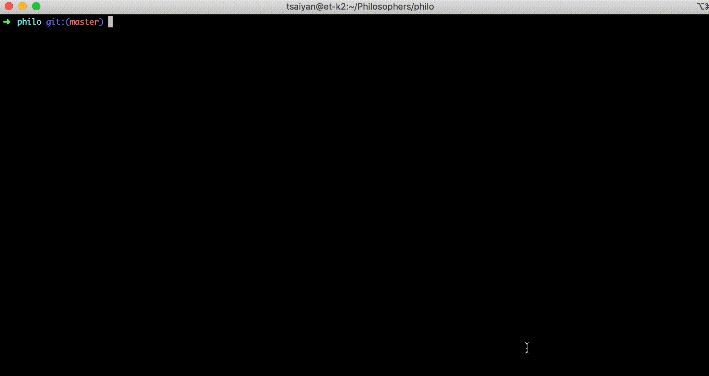

# Philosophers

#### Objective:
Write a program, that will be imitate the life of philosophers.  They need to eat and sleep, and will die if haven't eat in time.
To eat phisophers need 2 forks.

#### How to run:
	./philo philo_count time_to_die time_to_eat time_to_sleep

##### Example:
	./philo 4 800 200 200

#### Skills:
Processes, threads, semaphors, mutexes.

#### Projects written with the NORM 42.
Basic points:
  - 25 strings max in func.
  - 5 funcs in file, max 4 arguments, max 5 variables.
  - One declaration = one string.
  - Declaration and initialisation can't be in same string.
  - Forbitten to use: for, switch, do...while, go to, case, Conditional operator.
  - No comments in body of functions.

